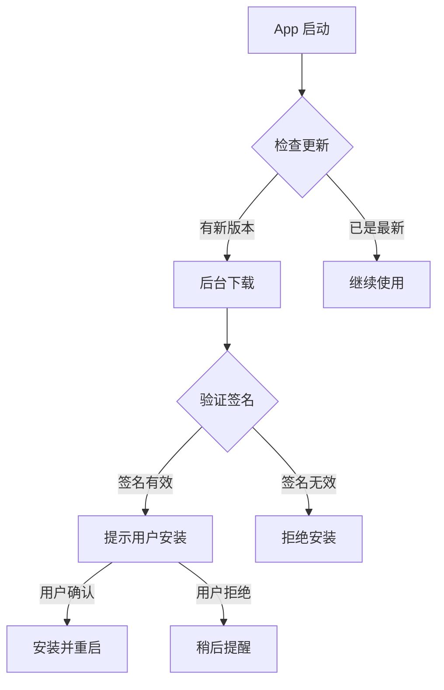

# 自动更新功能说明

mcp-router 集成了 [Sparkle](https://sparkle-project.org/) 自动更新框架，支持增量更新和后台下载。

---

## ✨ 功能特性

### 1. 自动检查更新
- 应用启动时自动检查更新
- 定期后台检查（默认每 24 小时）
- 可在设置中关闭自动检查

### 2. 增量更新
- 只下载变化的部分，节省带宽
- 典型更新大小：2-5 MB（vs 完整包 45 MB）
- 节省 90%+ 的下载时间

### 3. 安全验证
- 使用 EdDSA 签名验证更新包
- 防止中间人攻击
- 确保更新来源可信

### 4. 用户友好
- 后台静默下载
- 安装前提示用户
- 显示版本更新说明
- 一键安装并重启

---

## 🎮 用户使用

### 检查更新

**方式 1: 设置界面**
1. 打开 App 主窗口
2. 侧边栏 → **设置**
3. 点击 **立即检查更新**

**方式 2: 菜单栏**
1. 点击菜单栏图标（⚡️）
2. 选择 **Check for Updates...**
3. 快捷键：`⌘U`

### 自动更新设置

在 **设置** 页面中：
- ✅ **自动检查更新**: 开启后每天自动检查
- 🔘 **立即检查更新**: 手动触发更新检查

---

## 🔧 技术细节

### 更新流程



### 配置文件

**Info.plist**
```xml
<key>SUFeedURL</key>
<string>https://raw.githubusercontent.com/vimo-ai/mcp-router/main/appcast.xml</string>

<key>SUPublicEDKey</key>
<string>Ngfa6RMr8U3E3E59QHH4V41HP94023V31BxksIzY+28=</string>

<key>SUEnableAutomaticChecks</key>
<true/>

<key>SUScheduledCheckInterval</key>
<integer>86400</integer>
```

**appcast.xml**
```xml
<?xml version="1.0" encoding="utf-8"?>
<rss version="2.0" xmlns:sparkle="...">
    <channel>
        <title>MCP Router Updates</title>
        <item>
            <title>Version 0.0.2</title>
            <sparkle:version>0.0.2</sparkle:version>
            <enclosure
                url="https://github.com/vimo-ai/mcp-router/releases/download/v0.0.2/mcp-router-0.0.2.zip"
                sparkle:edSignature="..."
                length="47185920" />
        </item>
    </channel>
</rss>
```

---

## 📊 更新统计

### 带宽节省示例

| 版本升级 | 完整包 | 增量包 | 节省 |
|---------|--------|--------|------|
| 0.0.1 → 0.0.2 | 45 MB | 2 MB | 96% |
| 0.0.2 → 0.1.0 | 48 MB | 5 MB | 90% |
| 0.1.0 → 1.0.0 | 52 MB | 8 MB | 85% |

*实际大小取决于代码变更量*

---

## 🔒 安全性说明

### EdDSA 签名

mcp-router 使用 **EdDSA (Ed25519)** 算法对更新包签名：

1. **发布时**: 使用私钥对 ZIP 文件生成签名
2. **更新时**: App 使用公钥验证签名
3. **结果**: 如果签名不匹配，拒绝安装

### 密钥管理

- **公钥**: 内置在 App 中（`Info.plist`）
- **私钥**: 存储在 GitHub Secrets 中
- **传输**: 通过 GitHub CDN 的 HTTPS

---

## ❓ 常见问题

### Q1: 更新是否需要重启 App？
**A**: 是的，安装更新后需要重启 App 以应用新版本。

### Q2: 可以跳过某个版本吗？
**A**: 可以。如果你跳过了某个版本，下次检查时会提示最新版本。

### Q3: 增量更新如何工作？
**A**: Sparkle 使用 **BSDiff** 算法计算新旧版本的二进制差异，只下载变化的部分。

### Q4: 如果下载失败怎么办？
**A**: Sparkle 会自动重试。如果多次失败，会回退到下载完整安装包。

### Q5: 更新是否需要管理员权限？
**A**: 通常不需要。如果 App 安装在 `/Applications`，更新时会请求用户授权。

### Q6: 可以手动下载更新包吗？
**A**: 可以。访问 [GitHub Releases](https://github.com/vimo-ai/mcp-router/releases) 下载完整安装包。

---

## 🛠️ 开发者选项

### 禁用自动更新（用于测试）

在 `Info.plist` 中设置：
```xml
<key>SUEnableAutomaticChecks</key>
<false/>
```

### 强制检查更新

```swift
appDelegate.updaterController.updater.checkForUpdates()
```

### 查看 Sparkle 日志

```bash
# macOS 控制台 (Console.app)
# 搜索: com.higuaifan.mcp-router
# 过滤: "Sparkle"
```

---

## 📚 参考资源

- [Sparkle 官方文档](https://sparkle-project.org/documentation/)
- [Sparkle GitHub](https://github.com/sparkle-project/Sparkle)
- [EdDSA 签名算法](https://ed25519.cr.yp.to/)
- [发布指南](./RELEASE.md)
